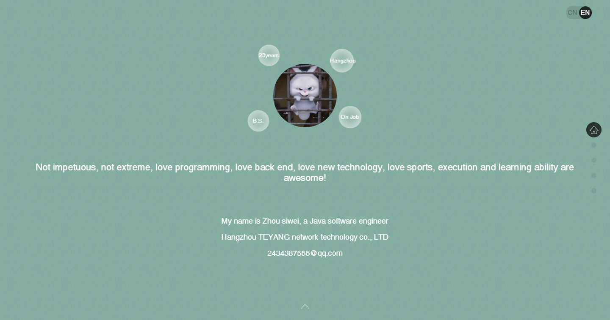
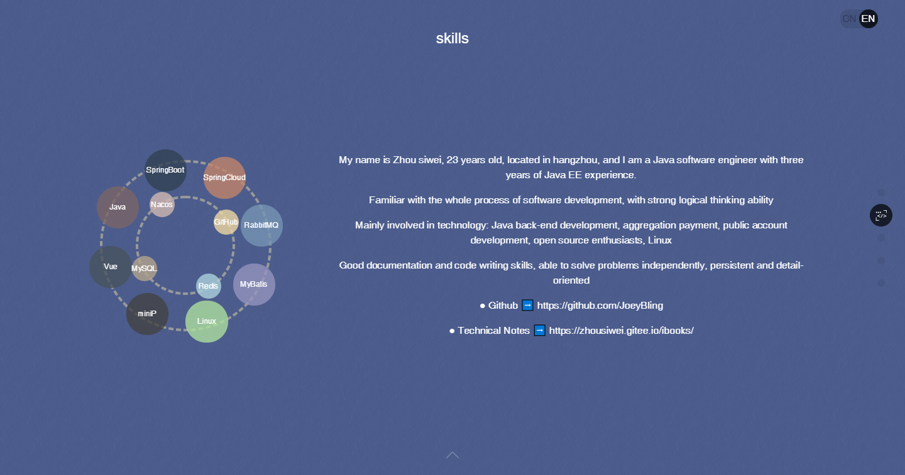
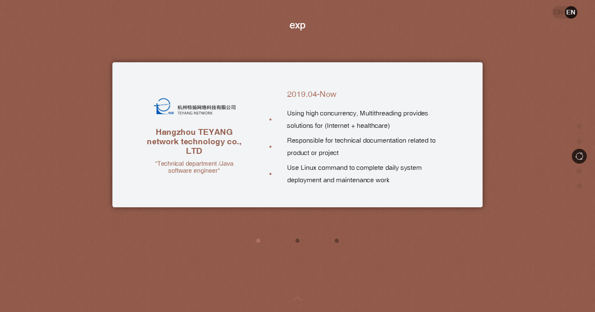
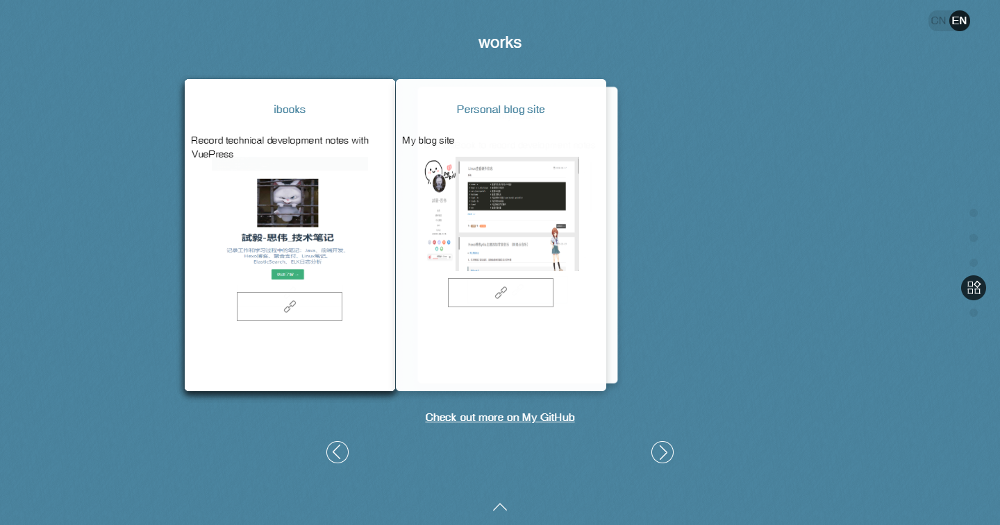
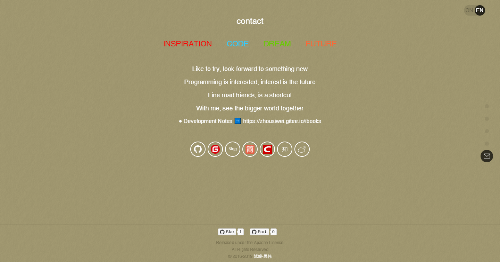

## [Resume of PHP Software Engineer](https://resume.linyiyuan.top)

- English | [中文](README.md)


## Introduction
- **This project originated from：[https://github.com/zhaoky/flqin](https://github.com/zhaoky/flqin "https://github.com/zhaoky/flqin")。Great respect to the author。**

## Online Preview

> **Preview ➡️ [https://resume.linyiyuan.top](https://resume.linyiyuan.top)**

## Project Screenshots

[](http://resume.linyiyuan.top "linyiyuan's resume")
[](http://resume.linyiyuan.top "linyiyuan's resume")
[](http://resume.linyiyuan.top "linyiyuan's resume")
[](http://resume.linyiyuan.top "linyiyuan's resume")
[](http://resume.linyiyuan.top "linyiyuan's resume")

## Local Preview
1. Install `node.js/npm`

2. Run
```bash
npm install
npm run dev
```

## Compile
```bash
npm run build   //or `yarn run build`
```

## Project support

### [@korey/MVVM](https://github.com/zhaoky/mvvm)

> A simple MVVM framework, which currently implements the functions of data-binding and view-refresh, is still being optimized and updated. Welcome to learn and exchange ideas.

### [@korey/Fullpage](https://github.com/zhaoky/fullpage)

> A simple Fullpage framework, the current implementation of up and down, pulley rolling, direct anchor full-screen page-turning function, is still continuing to optimize and update, welcome to learn exchange.


**Always trying, never giving up**
> Not impetuous, not radical, not conservative, love programming, love the back end, love new technology, love sports, love travel, execution and learning ability are awesome!


## License

[Apache License](./LICENSE)
