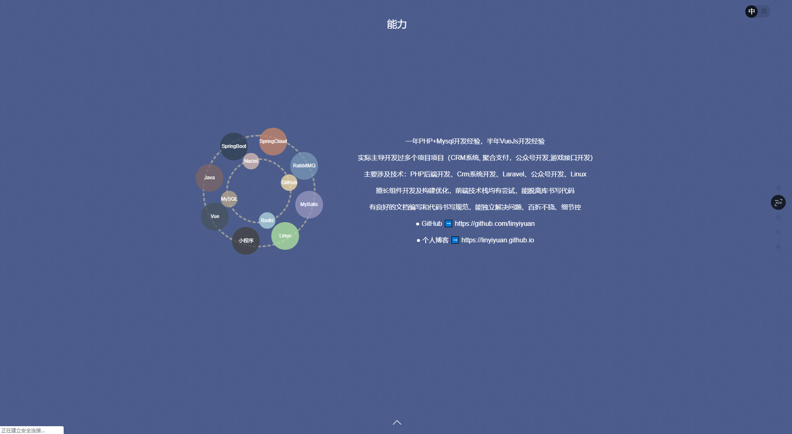
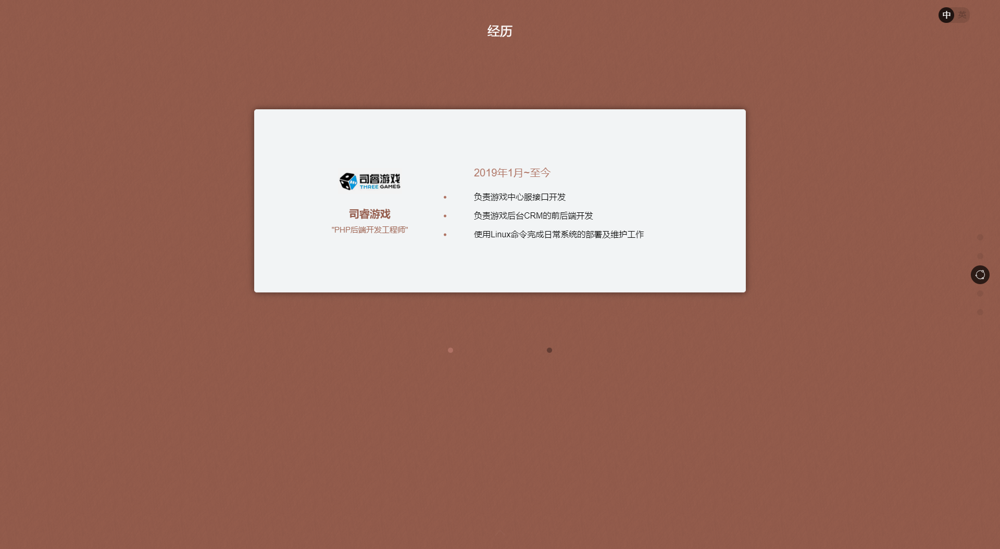

## [PHP开发工程师简历](https://resume.linyiyuan.top)

- [English](README.en.md) | 中文

## 介绍

- **本项目源于：[https://github.com/zhaoky/flqin](https://github.com/zhaoky/flqin "https\://github.com/zhaoky/flqin")。向作者表示深深的敬意。**

## 线上预览

> **预览 ➡️ [https://resume.linyiyuan.top](http://resume.linyiyuan.top)**

## 项目截图

[](http://resume.linyiyuan.top "林益远的个人简历")
[](http://resume.linyiyuan.top "林益远的个人简历")
[](http://resume.linyiyuan.top "林益远的个人简历")
[](http://resume.linyiyuan.top "林益远的个人简历")
[](http://resume.linyiyuan.top "林益远的个人简历")

## 本地预览

1. 安装 `node.js/npm`

2. 运行

```bash
npm install
npm run dev
```

## 编译部署

```bash
npm run build   //或者 yarn run build
```

## 项目支持

### [@korey/MVVM](https://github.com/zhaoky/mvvm)

> 一个简易的 MVVM 框架，目前实现了 data-binding 和 view-refresh 的功能，仍在不断优化更新，欢迎学习交流。

### [@korey/Fullpage](https://github.com/zhaoky/fullpage)

> 一个简易的 Fullpage 框架，目前实现了上拉下拉，滑轮滚动，锚点直达的全屏翻页功能，仍在不断优化更新，欢迎学习交流。

## License

[Apache License](./LICENSE)
